```
 ██████╗ ███████╗███╗   ██╗████████╗██╗  ██╗ █████╗ ███╗   ██╗ ██████╗ 
██╔════╝ ██╔════╝████╗  ██║╚══██╔══╝██║  ██║██╔══██╗████╗  ██║██╔════╝ 
██║  ███╗█████╗  ██╔██╗ ██║   ██║   ███████║███████║██╔██╗ ██║██║  ███╗
██║   ██║██╔══╝  ██║╚██╗██║   ██║   ██╔══██║██╔══██║██║╚██╗██║██║   ██║
╚██████╔╝███████╗██║ ╚████║   ██║   ██║  ██║██║  ██║██║ ╚████║╚██████╔╝
 ╚═════╝ ╚══════╝╚═╝  ╚═══╝   ╚═╝   ╚═╝  ╚═╝╚═╝  ╚═╝╚═╝  ╚═══╝ ╚═════╝ 
▀▀▀▀▀▀▀▀▀▀▀▀▀▀▀▀▀▀▀▀▀▀▀▀▀▀▀▀▀▀▀▀▀▀▀▀▀▀▀▀▀▀▀▀▀▀▀▀▀▀▀▀▀▀▀▀▀▀▀▀▀▀▀▀▀▀▀▀▀▀▀▀▀
      M E G A   D R I V E  /  G E N E S I S   ·   T A N G   N A N O   2 0 K
```

# Gen Thang

Gen Thang turns a [Sipeed Tang Nano 20K](https://wiki.sipeed.com/hardware/en/tang/Tang-Nano-20K/Nano-20K.html)
FPGA board into a self-contained Sega Mega Drive / Genesis console. Games load from
a FAT32 or exFAT TF card through an on-screen menu, and video and audio leave the
board over 720p HDMI. No computer is needed once the FPGA image has been programmed.

<p align="center">
  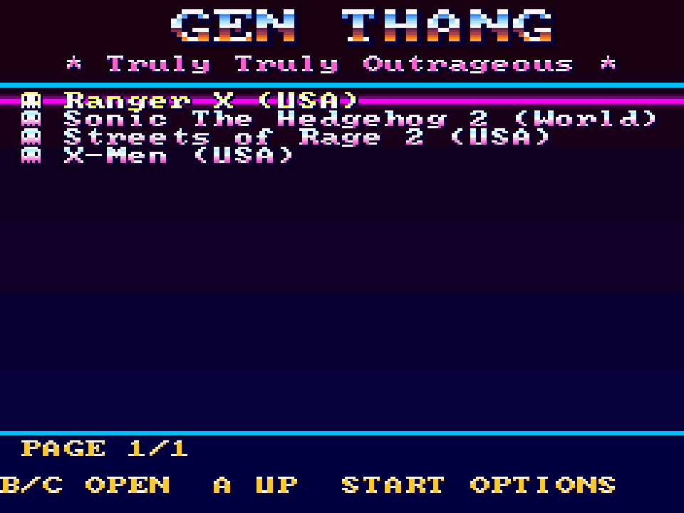
  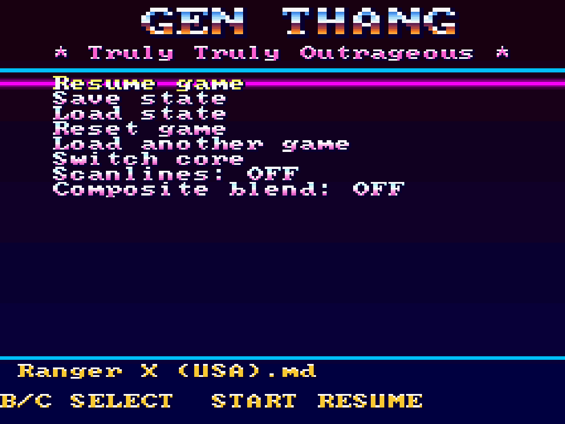
</p>
<p align="center"><sub>Menu overlay rendered by the Verilator testbench (see
<a href="#simulation-and-screenshots">Simulation and screenshots</a>).</sub></p>

> **Alpha software.** Gen Thang is under active development and is published as an
> early alpha. Expect bugs, game-compatibility gaps, missing features and breaking
> changes between releases. The default dual-DB9 build and raw-button variant are
> built and timing-checked but have not yet been tested on the new canonical wiring. The
> legacy single-DB9 breadboard image was tested by the author with a wired Genesis
> pad on its now-deprecated wiring, but only that one setup. Save
> states are experimental. Core switching rewrites the board's SPI flash. There is
> no warranty; you build, wire and flash at your own risk, and wiring mistakes can
> damage the board or a controller. See [Disclaimer](#disclaimer).

## Contents

- [Features](#features) · [Game gallery](#game-gallery-streets-of-rage-2-sonic-2-and-x-men) · [What you need](#what-you-need) · [Choose a release image](#choose-a-release-image)
- [Setup](#setup): [flash](#1-flash-the-board) · [TF card](#2-prepare-the-tf-card) · [controllers](#3-connect-a-controller)
- [Using Gen Thang](#using-gen-thang): [controls](#controls) · [options](#options-menu) · [display options](#display-options) · [save states](#save-states) · [USB upload](#uploading-roms-over-usb-serial) · [core switching](#switching-cores)
- [Build from source](#build-from-source) · [Simulation and screenshots](#simulation-and-screenshots)
- [Limitations and troubleshooting](#limitations-and-troubleshooting)
- [Credits and tooling](#credits-and-tooling) · [Disclaimer](#disclaimer) · [License](#license)

## Features

- Motorola 68000 (fx68k), Z80 (T80), VDP, YM2612 (JT12) and SN76489 (JT89)
  implementations from the MiSTer Genesis core, running at 54 MHz and locked to
  the 60 Hz HDMI frame.
- 720p HDMI with audio. The picture is scaled to a centred 4:3 window.
- ROM browser on the TF card (`.md`, `.bin`, `.gen`, up to 4 MB) with an options
  page for resume, reset, save/load state and display settings.
- Controller options: two Genesis 3/6-button pads on DB9 breakouts (default), or
  twelve directly wired buttons for handhelds on the same physical GPIO layout.
- One save-state slot per game, with "Resume saved game" after a power cycle.
- Scanline and composite-blend display options.
- Optional ROM and core-image upload over the board's USB serial port.

Not supported: SVP (Virtua Racing), EEPROM cartridges, Game Genie, interleaved
`.smd` ROMs and battery-backed cartridge saves (cartridge SRAM lives in SDRAM and is
only preserved inside a save state). Timing is fixed at NTSC / 60 Hz, as inherited
from MDTang.

## Game gallery: Streets of Rage 2, Sonic 2 and X-Men

Gen Thang's Genesis core playing the intro and attract mode (the unattended
demo) of three games, from ROMs you supply. These native 320x224 frames were
captured from Gen Thang running in its Verilator reference testbench (ideal memory;
see [Simulation and screenshots](#simulation-and-screenshots)). They are Gen Thang
simulation output, not captures from another emulator or from the physical HDMI port.

### Streets of Rage 2

<table>
  <tr>
    <td><br><sub>Boot logo</sub></td>
    <td>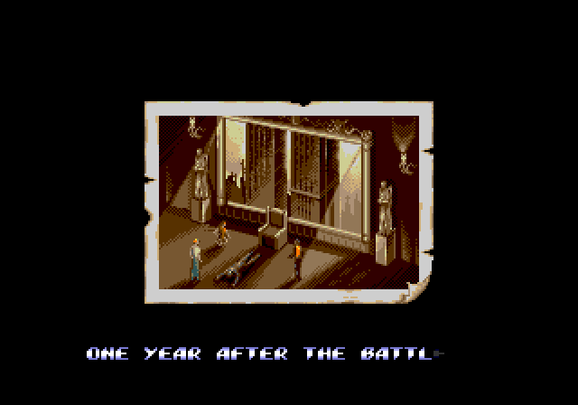<br><sub>Story intro</sub></td>
    <td>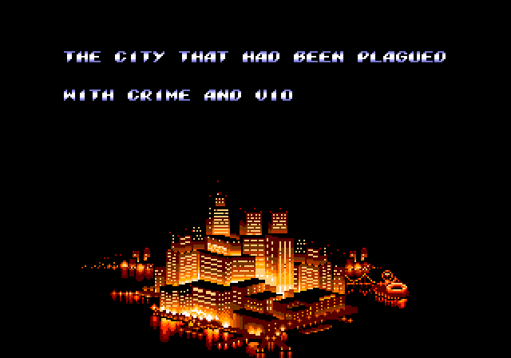<br><sub>The city</sub></td>
    <td>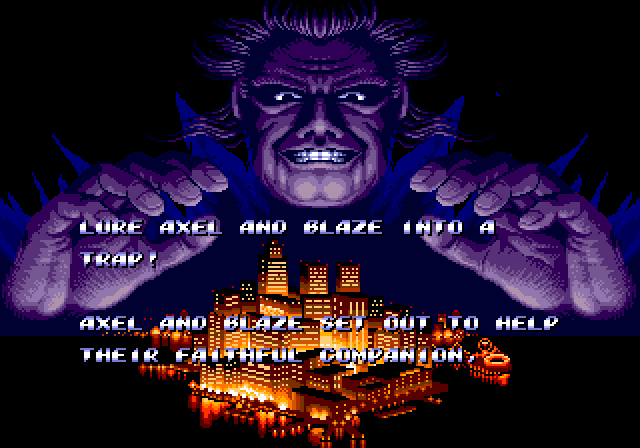<br><sub>Mr. X and the city</sub></td>
  </tr>
  <tr>
    <td>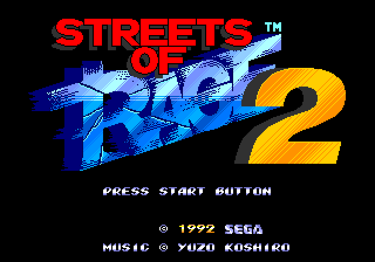<br><sub>Title screen</sub></td>
    <td>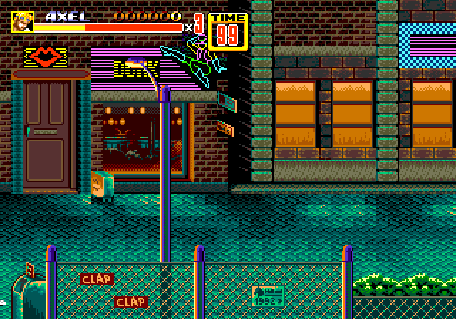<br><sub>Attract mode: Stage 1</sub></td>
    <td>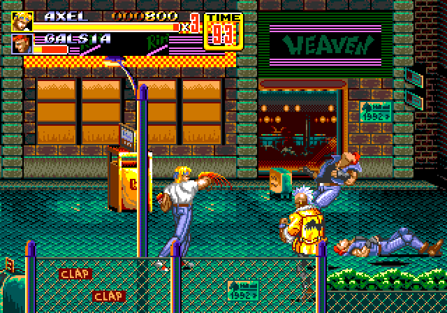<br><sub>Attract mode: a fight</sub></td>
    <td>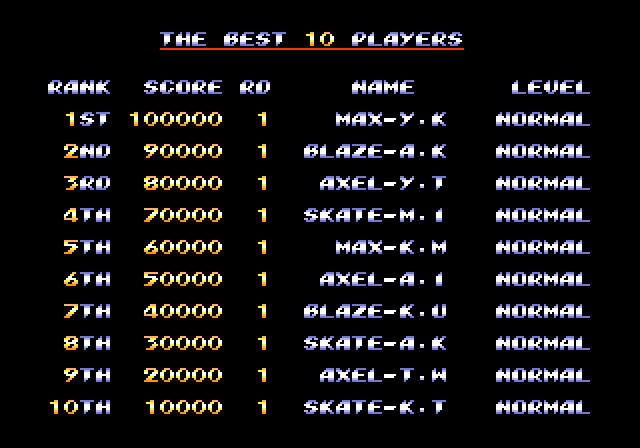<br><sub>High scores</sub></td>
  </tr>
</table>

### Sonic The Hedgehog 2

<table>
  <tr>
    <td><br><sub>Boot logo</sub></td>
    <td>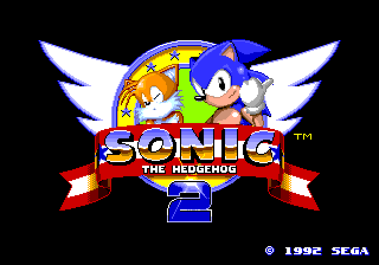<br><sub>Title screen</sub></td>
    <td>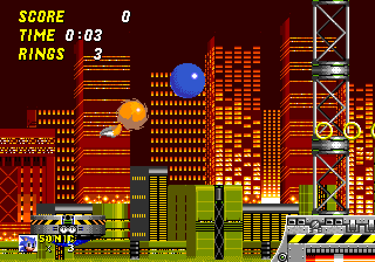<br><sub>Chemical Plant Zone (demo)</sub></td>
  </tr>
  <tr>
    <td>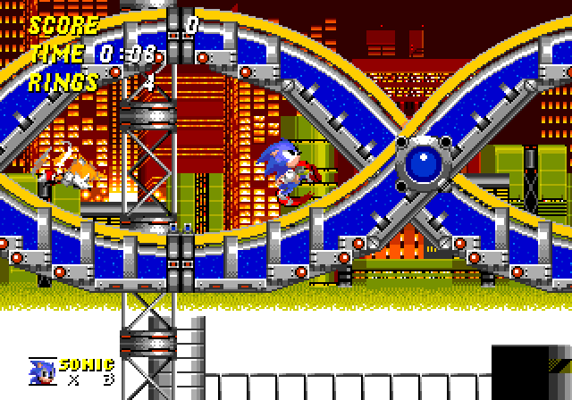<br><sub>Chemical Plant Zone (demo)</sub></td>
    <td>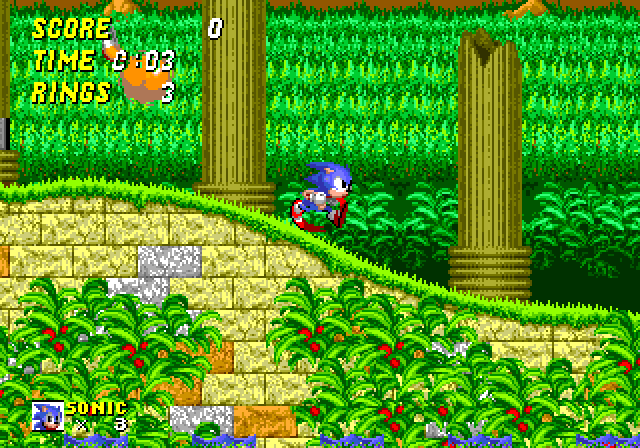<br><sub>Aquatic Ruin Zone (demo)</sub></td>
    <td>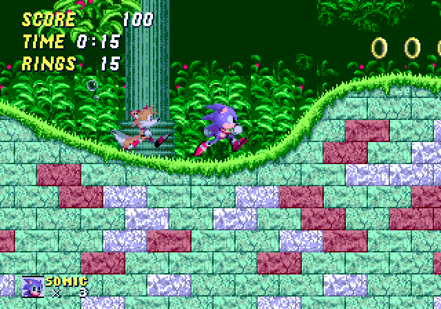<br><sub>Aquatic Ruin Zone (demo)</sub></td>
  </tr>
</table>

### X-Men

<table>
  <tr>
    <td>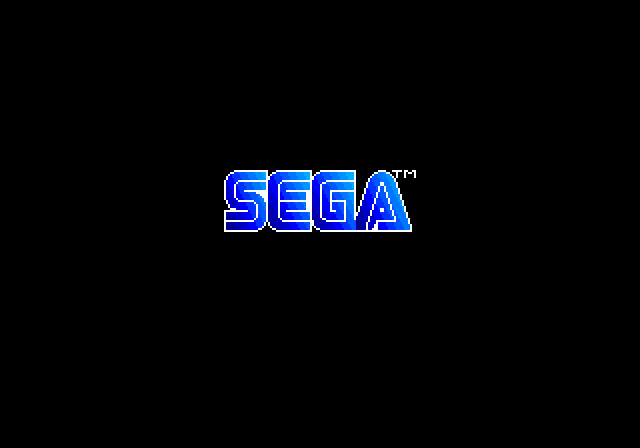<br><sub>Boot logo</sub></td>
    <td>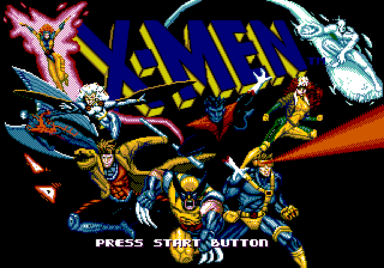<br><sub>Title screen</sub></td>
    <td>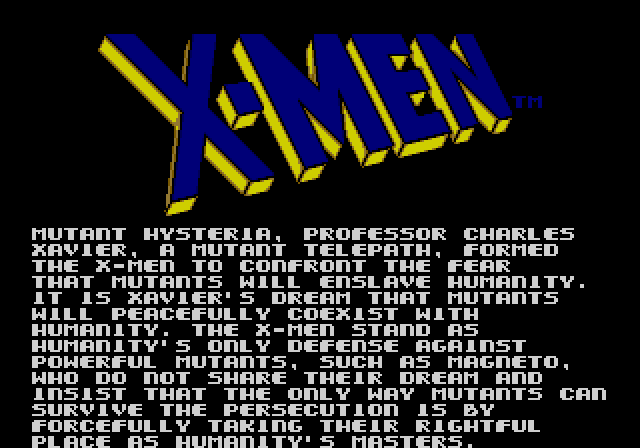<br><sub>Story text</sub></td>
    <td>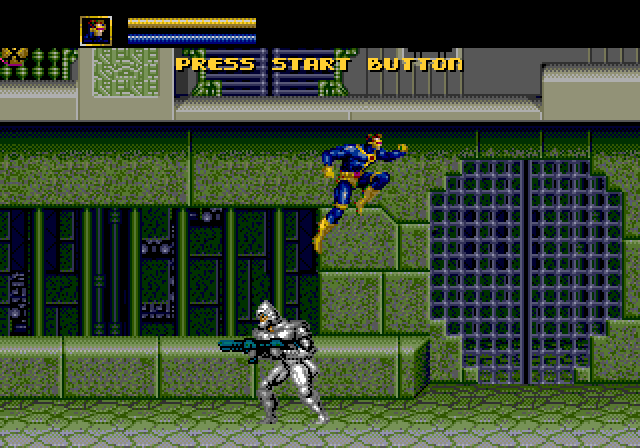<br><sub>Demo: Cyclops</sub></td>
  </tr>
  <tr>
    <td>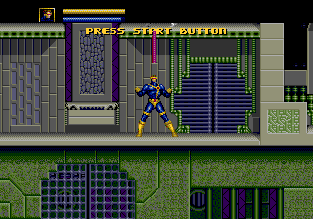<br><sub>Demo: Cyclops</sub></td>
    <td>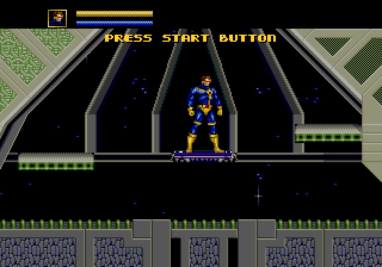<br><sub>Demo: Cyclops</sub></td>
    <td>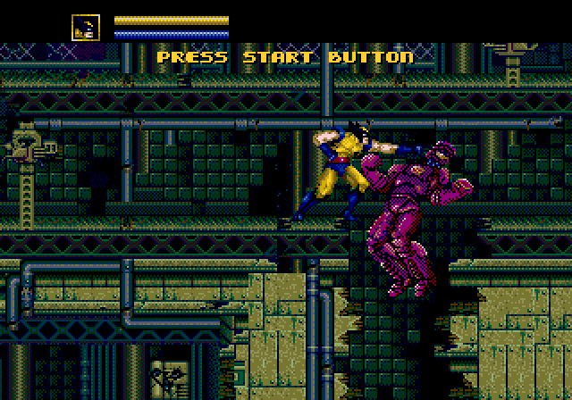<br><sub>Demo: Wolverine</sub></td>
    <td>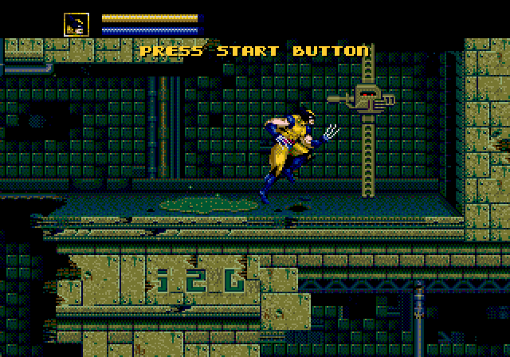<br><sub>Demo: Wolverine</sub></td>
  </tr>
</table>

<sub>Frames produced by Gen Thang running in its Verilator reference testbench.
That testbench uses ideal memory and BRAM VRAM rather than the full board's SDRAM
controller and menu firmware; these are simulation captures, not physical HDMI
captures.</sub>

## What you need

- Tang Nano 20K and a USB-C cable.
- microSD / TF card (FAT32 or exFAT) and your own Mega Drive ROM files.
- HDMI display (with audio, if you want sound).
- A controller arrangement from [step 3](#3-connect-a-controller).
- Gowin Programmer (part of Gowin EDA) to write the flash. The Education edition
  1.9.11.03 is what was used for the releases.

ROM images and other copyrighted game data are **not** included.

## Choose a release image

Each release contains a bitstream for every controller arrangement. Every
`*_flash.bin` is a complete SPI-flash image (bitstream at `0x000000`, menu
firmware at `0x500000`); the `.fs` files are bitstream-only.

| Image | Controllers | Notes |
|---|---|---|
| `genthang_nano20k_db9_flash.bin` | Two Genesis pads on DB9 breakouts (default) | Canonical J6/J5 wiring, 3.3 V only; see [dual Genesis pads](#dual-genesis-pads-db9-build) |
| `genthang_nano20k_raw_flash.bin` | Twelve direct buttons | Uses exactly the same 12 data GPIOs as the DB9 build; see [direct buttons](#direct-buttons-raw-build) |

The wiring must match the image you flash. A mismatched image reads the wrong pins.

## Setup

### 1. Flash the board

Write the `*_flash.bin` for your controller arrangement at SPI-flash address
`0x000000`. Verify it against the release's `SHA256SUMS` first
(`sha256sum -c SHA256SUMS --ignore-missing`).

**Gowin Programmer GUI (Windows or Linux):** connect the board, open *Gowin
Programmer*, choose series **GW2AR** and device **GW2AR-18C**, then double-click the
operation. Set *Access Mode* to **External Flash Mode** and *Operation* to **exFlash
Erase, Program thru GAO-bridge**, pick the `*_flash.bin` file (switch the file
filter to `*.*`), set *Start Address* to `0x000000` and run it. The
[SNESTang installation guide](https://github.com/nand2mario/snestang/blob/main/doc/installation.md)
has screenshots of the same dialogs.

**Linux, command line:** the on-board BL616 debugger claims the FTDI interface;
release it first (repeat after every replug), then use the programmer. In our
testing openFPGALoader did not work with this board's debugger.

```sh
echo -n 1-2:1.0 | sudo tee /sys/bus/usb/drivers/ftdi_sio/unbind   # adjust 1-2 to your USB port
cd "$GOWIN_HOME/Programmer/bin"      # your Gowin EDA install directory
QT_QPA_PLATFORM=minimal ./programmer_cli --device GW2AR-18C --run 39 \
    --mcuFile /path/to/genthang_nano20k_db9_flash.bin --spiaddr 0x000000
```

A `.fs` file can be loaded into SRAM for a quick test, but it does not include the
menu firmware, so a flash image is required for normal use.

### 2. Prepare the TF card

Format the card with an MBR partition table and a FAT32 (or exFAT) filesystem, then
copy your `.md`, `.bin` or `.gen` ROMs onto it, in folders if you like. On Linux:

```sh
sudo parted /dev/sdX --script mklabel msdos mkpart primary fat32 1MiB 100%
sudo mkfs.vfat -F 32 -n GENTHANG /dev/sdX1
```

(Replace `/dev/sdX` with your card and double-check it first: this erases the card.)
Insert the card, connect HDMI and a controller, then power the board. You can also
copy ROMs later over USB without removing the card; see
[Uploading ROMs over USB serial](#uploading-roms-over-usb-serial).

### 3. Connect a controller

Always **power the board off before wiring** controllers. The FPGA pins are 3.3 V
only and are not 5 V tolerant. In the tables below, the "FPGA pin" is the GPIO
number used in the constraints file; the "Nano contact" is the header position,
counted 1-20 from the USB-C end with the board viewed from above (USB at the top):
**J6** is the left header and **J5** the right header.

Deprecated DualShock and original single-DB9 layouts are documented separately in
[deprecated controller pinouts](docs/deprecated-pinouts.md). They are not included
in current releases.

#### Dual Genesis pads (`db9` build)

For two wired 3- or 6-button Genesis pads, use
`genthang_nano20k_db9_flash.bin`. Player 1 is entirely on J6 and player 2 entirely on J5.
Leave the Nano LCD connector and speaker header empty. Both ports use 3.3 V with
internal pull-ups; never connect either controller to 5 V or hot-plug it.

| DB9 pin (male) | Signal | Player 1 FPGA pin (contact) | Player 2 FPGA pin (contact) |
|---|---|---|---|
| 1 | Up / D0 | 73 (J6.1) | 42 (J5.5) |
| 2 | Down / D1 | 74 (J6.2) | 41 (J5.6) |
| 3 | Left / D2 | 77 (J6.5) | 51 (J5.9) |
| 4 | Right / D3 | 27 (J6.8) | 48 (J5.10) |
| 5 | Pad supply | **3.3 V, not 5 V** (J6.19) | **3.3 V, not 5 V** (J5.16) |
| 6 | TL (B / A) | 28 (J6.9) | 49 (J5.12) |
| 7 | TH select (output) | 29 (J6.12) | 72 (J5.17) |
| 8 | Ground | GND (J6.20) | GND (J5.15) |
| 9 | TR (C / Start) | 30 (J6.13) | 71 (J5.18) |

##### P1 breadboard wiring

P1 can be built on a 30-row breadboard using only J6. Seat the Nano
component-side up with USB-C at the top, put J6.1 in hole `b5`, and connect a
passive **male DB9 screw-terminal or solder-cup breakout** with nine jumpers:

| DB9 pin | Function | Breakout jumper | Nano hole | Nano contact |
|---:|---|---|---|---|
| 1 | Up / D0 | terminal 1 to `a5` | `b5` | J6.1, GPIO73 |
| 2 | Down / D1 | terminal 2 to `a6` | `b6` | J6.2, GPIO74 |
| 3 | Left / D2 | terminal 3 to `a9` | `b9` | J6.5, GPIO77 |
| 4 | Right / D3 | terminal 4 to `a12` | `b12` | J6.8, GPIO27 |
| 5 | Controller supply | terminal 5 to `a23` | `b23` | J6.19, **3.3 V only** |
| 6 | TL / B, A | terminal 6 to `a13` | `b13` | J6.9, GPIO28 |
| 7 | TH select | terminal 7 to `a16` | `b16` | J6.12, GPIO29 |
| 8 | Ground | terminal 8 to `a24` | `b24` | J6.20, GND |
| 9 | TR / C, Start | terminal 9 to `a17` | `b17` | J6.13, GPIO30 |

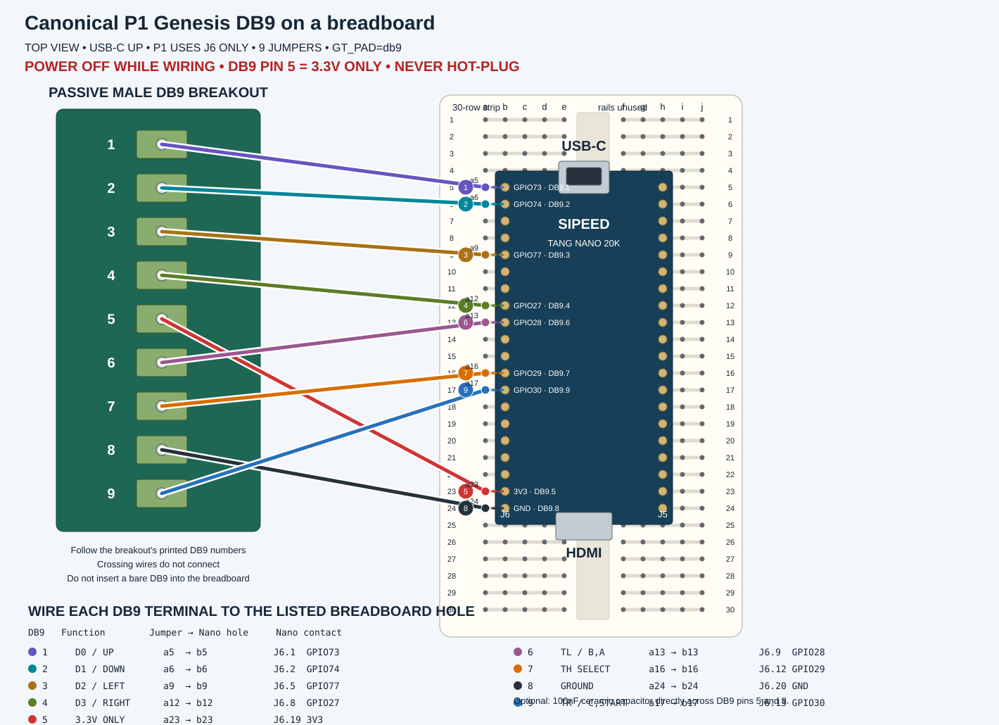

A bare DB9 does not fit a 2.54 mm breadboard. Check the numbered terminals and
your breadboard's internal row connections with a continuity meter before
connecting the Nano. DB9 pin 5 is **3.3 V only, never 5 V**; power off before
wiring or connecting a controller, and do not hot-plug this unprotected setup.
An optional 100 nF ceramic capacitor may be fitted directly across DB9 pins 5
and 8. Use the normal `genthang_nano20k_db9_flash.bin`; P2 may remain
disconnected.

Build it with:

```sh
GT_PAD=db9 ./build.sh
```

#### Direct buttons (`raw` build)

For handheld builds: twelve buttons, each switching an FPGA pin to GND (the
internal pull-ups are enabled).

| Button | Pin | Button | Pin | Button | Pin |
|---|---|---|---|---|---|
| A | 74 (J6.2) | B | 73 (J6.1) | C | 51 (J5.9) |
| X | 49 (J5.12) | Y | 48 (J5.10) | Z | 71 (J5.18) |
| Mode | 77 (J6.5) | Start | 27 (J6.8) | Up | 41 (J5.6) |
| Down | 42 (J5.5) | Left | 30 (J6.13) | Right | 28 (J6.9) |

In vector order, `btn_n[0..11]` uses the same pins as
`db9_d[0..5], db9b_d[0..5]`: `73, 74, 77, 27, 28, 30, 42, 41, 51, 48, 49, 71`.
Their Genesis functions are `B, A, Mode, Start, Up, Down, Left, Right, C, Y, X, Z`.
The DB9 TH outputs on GPIO29 and GPIO72 are unused by the raw build.

## Using Gen Thang

At power-on the menu lists the card's folders and ROMs sorted by name. If the card
cannot be read the status line says why (no reply, not initialised, not FAT32 /
exFAT). Picking a ROM streams it into SDRAM (about 7 s for 2 MB) and starts the game.

### Controls

Everything in the menus needs only the D-pad, A/B/C and Start, so a 3-button pad
is enough. Player 1 drives the menu; player 2 only plays.

| Genesis control | Games page | Options page | In game |
|---|---|---|---|
| D-pad | move; Left/Right = page | move; Left/Right = change value | D-pad |
| A | parent folder | back to games (no game loaded) | A |
| B / C | open folder / load ROM | select | B / C |
| X / Y / Z | - | - | X / Y / Z |
| Start | open Options | resume the game | Start |
| Start+A+B+C or Mode+Start | resume the game | resume the game | open the menu (the game pauses) |

### Options menu

The Options page opens first when you call up the menu during a game:

- **Resume game**, **Save state**, **Load state**, **Reset game**, **Load another game**
- **Switch core**: choose a complete `.bin` image from `/cores` (see below)
- **Scanlines**: off, 25 %, 50 %
- **Composite blend**: off, on, adaptive

The running firmware version is shown below the **GEN THANG** title on every menu page.

Opening the menu pauses the game and mutes HDMI audio. **Reset game** pulses the
console reset input without clearing work RAM, like the physical Genesis reset
button (this is the reset X-Men's Mojo level expects). Display settings are saved
to `GENTHANG.CFG` on the card and never affect the menu itself.

### Display options

The menu draws at 256x224 and the game at 320x224 or 256x224, both scaled into the
same centred 960x720 (4:3) window inside the 1280x720 HDMI frame. Two
post-processing options are applied by the HDMI scaler:

- **Scanlines** dims the lower half of each Genesis line by 25 % or 50 %. It is
  skipped in interlaced modes.
- **Composite blend** averages each pixel with its left neighbour, which melts the
  dither patterns many games use for transparency and shading the way a composite
  cable does. *Adaptive* limits the blend to pixels the VDP flags as transparency
  dither, leaving the rest of the picture sharp.
<table>
  <tr>
    <td align="center"><br><sub>Off</sub></td>
    <td align="center"><br><sub>Scanlines 50 %</sub></td>
    <td align="center">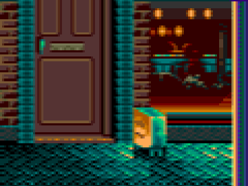<br><sub>Composite blend: on</sub></td>
  </tr>
</table>

<sub>Crops of a frame produced by Gen Thang's Verilator reference testbench. The
testbenches stop before the HDMI scaler, so [verilator/hdmi_preview.py](verilator/hdmi_preview.py)
applies the scaler arithmetic from `src/framebuffer_sync.sv`; these are simulated
Gen Thang output rather than physical HDMI captures. Adaptive mode depends on a
per-pixel VDP flag that a frame dump does not contain and cannot be previewed this
way.</sub>

### Save states

Save states are **experimental**. There is one slot per game, stored next to the ROM
as `<rom name>.ss0` (about 200 KB). **Save state** and **Load state** from the
Options page return you to the game. The last ROM path is stored in `GENTHANG.CFG`,
so after a power cycle the start-up options offer **Resume saved game**, which
reloads that ROM and restores its state.

How it works: the menu parks the 68000 in a small routine
([firmware/m68k/savestate.s](firmware/m68k/savestate.s)) through a level-7
interrupt, freezes the Z80 at an instruction boundary, and saves work RAM, VRAM,
CRAM, VSRAM, VDP registers, Z80 RAM and registers, YM2612 registers, I/O and
cartridge SRAM. **Not saved:** PSG and YM2612 key-on state (notes resume at the next
key-on), the VDP FIFO and the raster position. A state only fits the exact ROM it was
made from.

### Uploading ROMs over USB serial

`genthang-upload` copies ROMs or core images to the inserted TF card through the Nano
20K's USB serial port. The card stays FAT32 / exFAT and still works in a normal
reader.

```sh
./upload/genthang-upload /dev/ttyUSB0 game.md
./upload/genthang-upload /dev/ttyUSB0 game.md --name "Game Name.md"
./upload/genthang-upload-gui.py     # GTK 3 frontend (needs the GTK 3 Python bindings)
```

The GUI detects the Sipeed debugger, accepts files by picker or drag and drop, and
shows progress and device errors. The transfer is CRC32-verified before it replaces
the destination, so an interrupted upload leaves the previous file intact. **Leave
the on-screen menu open during the transfer**: the PicoRV32 is stalled while a game
runs and cannot receive anything. The tool defaults to 460800 baud because the
debugger's USB-UART runs at four times the FPGA's setting; use `--baud 115200` with
corrected debugger firmware. On Linux your user needs access to the serial device
(usually the `dialout` group).

### Switching cores

*Switch core* lists complete SPI-flash images (`.bin`) in `/cores`, programs the one
you pick into the board's flash and asks you to power-cycle. Upload one with
`./upload/genthang-upload /dev/ttyUSB0 other_flash.bin --core` (up to 8 MB, a full flash
image, not a Gowin `.fs`; Gen Thang's own `*_flash.bin` files qualify). **Do not
remove power while the menu says `FLASHING`.** An interrupted write may need
recovery with Gowin Programmer over USB.

## Build from source

### Toolchain

- **Gowin EDA** Education 1.9.11.03 or a compatible release (`gw_sh`). Set
  `GOWIN_HOME` to its install directory (or `GW_SH` to the `gw_sh` binary, or put
  `gw_sh` on `PATH`); `build.sh` then sets the software rendering and FreeType
  environment the tools need on Linux. No install location is assumed. The IDE
  project uses SystemVerilog 2017.
- Only to change the menu: a RISC-V GCC (`riscv64-unknown-elf`, with picolibc) and
  m68k binutils. `firmware/firmware.bin` and `firmware/ss_stub.h` are committed and
  were checked to rebuild bit-for-bit with GCC 13.2 / binutils 2.42.
- Only for simulation: Verilator 5, `mtools` and `mkfs.vfat`.

```sh
git clone https://github.com/shawnchivers/genthang.git
cd genthang
./build.sh                        # impl/pnr/genthang_nano20k_db9.fs, dual DB9 build
GT_PAD=raw ./build.sh             # twelve direct buttons on canonical data GPIOs
./release.sh                      # supported variants + flash images + tarball in release/
```

`GT_PAD` (`db9`, `raw`) selects the supported pad ports in `src/mdtang_top.sv`, through
`src/pad_config.vh` (written by `build.tcl`) and `src/boards/nano20k_<pad>.cst`.
DB9 and raw share one physical 12-data-GPIO contract; DB9 additionally uses two TH
outputs. The old `GT_PINOUT=breadboard` and `breadboard-rev1` values are deprecated
aliases for canonical DB9 and print a warning. The archival `GT_PAD=ds` option is
also deprecated; see [deprecated controller pinouts](docs/deprecated-pinouts.md).
Gowin runs share intermediate files
in `impl/`, so do not run two builds concurrently in one checkout.

Gowin writes `impl/pnr/genthang_nano20k.bin` (bitstream) and `.fs`. Combine the
bitstream with the menu firmware into a flash image yourself with:

```sh
python3 merge_flash.py impl/pnr/genthang_nano20k.bin firmware/firmware.bin genthang_nano20k_flash.bin
```

`release.sh` does this for each variant and refuses to package a build that misses
the `clk_sys`, `clk_z80` or `hclk` targets or leaves negative setup/hold slack. The
design nearly fills the FPGA (see [Resource use](#resource-use)), so even small RTL
changes can break timing. Rebuild the menu with:

```sh
cd firmware
make RISCV=/usr/bin/riscv64-unknown-elf EXTRA_CFLAGS="-isystem /usr/lib/picolibc/riscv64-unknown-elf/include"
```

The internal module and file names (`mdtang_top`, `md20k_core`, `sdram_md20k`) keep
the project's MDTang lineage and are intentionally not renamed.

### Resource use

The design nearly fills the Nano 20K's FPGA. Release builds use timing-priority
placement and timing-directed routing. Post-route timing for this release has zero
negative setup and hold slack:

| Variant | `clk_sys` Fmax (needs 54.0 MHz) | `clk_z80` Fmax (needs 27.0 MHz) | `hclk` Fmax (needs 74.25 MHz) |
|---|---|---|---|
| `db9` | 62.323 MHz | 48.030 MHz | 75.319 MHz |
| `raw` | 59.156 MHz | 48.048 MHz | 82.109 MHz |

Every release build is rejected if a clock misses its target or the timing report
contains negative setup or hold slack.

## Simulation and screenshots

The Gen Thang Verilator testbenches in [verilator/](verilator) run the synthesisable
core with the real menu firmware against models of the SDRAM, SPI flash and TF card
(`make dut`), and the same Gen Thang Genesis core in a faster reference configuration
with ideal memory and BRAM VRAM but no menu, SDRAM controller or firmware (`make ref`).
The full-board configuration is too slow to reach the attract modes (see below), so
the game frames in this README come from Gen Thang's reference testbench; the menu
images (`menu-*.png`) come from its full-board testbench.

```sh
cd verilator
make dut ROM=/path/to/game.md              # whole board core + firmware + FAT32 card image
make run-dut ARGS="-T 1700 -O 900"         # boot the menu and dump the overlay (run/dut/overlay_900.ppm)
make textdisp                              # the menu overlay alone -> run/textdisp/*.ppm
make genesis-pad gen-io                    # unit tests for the DB9 pad reader and the I/O block
make ref ROM=/path/to/game.md && make run-ref ARGS="-n 300 -d 100,200"   # golden model
```

`make` needs `mcopy` and `mkfs.vfat`; set `MTOOLS=/dir/containing/mtools/` if `mcopy`
is not on `PATH`. `-t ms:len:mask` presses buttons at an absolute time and
`-p frame:len:mask` relative to the game start (mask bits 0-7: Right, Left, Down,
Up, A, B, C, Start; 8 Mode, 9 X, 10 Z, 11 Y; Mode+Start is `0x180`). `-d` dumps
frames as PPM, `-O` dumps the menu overlay. The simulation is slow (the whole board
runs at roughly 0.4 simulated seconds per minute), so a full ROM load takes tens of
minutes.

[verilator/hdmi_preview.py](verilator/hdmi_preview.py) converts a dumped frame or
overlay into a PNG as the HDMI scaler would show it (`--overlay`, `--scanlines`,
`--blend`, `--crop`). The images in [docs/images](docs/images) were produced this
way. Unit tests for the build selection and pin contract run with
`python3 -m unittest discover -s tests` (needs `tclsh`).

Results for this release: the full-board testbench booted the real menu firmware from
the SPI-flash model, initialised and mounted a FAT32 card model, loaded a 2.2 MB ROM
(560,691 ROM words written to SDRAM and checked against the file, none wrong; 4,422
card blocks read), started the game after 7.3 simulated seconds, and opened the menu
with Mode+Start during play, with zero SDRAM, flash and TF-card protocol errors.
The DB9 pad reader and the two-port I/O block unit tests pass, as do the four build
and pin-selection tests. The testbench does not exercise the HDMI frame lock, and
frame-by-frame equivalence of the whole board against the reference configuration
was not re-run for this release. The gallery therefore shows Gen Thang's Verilator
core output, not captures from the physical board's HDMI port. Hardware performance investigation notes are in
[docs/slowdown-test.md](docs/slowdown-test.md).

## Limitations and troubleshooting

- Alpha quality: compatibility is not exhaustive and timing is tight. Please report
  games that fail along with the image variant and ROM name.
- ROMs must be raw (not interleaved `.smd`), no larger than 4 MB, and use `.md`,
  `.bin` or `.gen`. No battery-backed saves are written; use save states.
- Save states are experimental and tied to the exact ROM; PSG phase, YM2612 key-on
  state, VDP FIFO contents and raster position are not restored.
- If the menu says the card is not FAT32/exFAT, reformat it with an MBR partition
  table and a FAT32 filesystem.
- USB upload needs the on-screen menu open, and serial access on your computer.
- Core switching rewrites the SPI flash; never interrupt power while it says
  `FLASHING`.
- Some Genesis pads need 5 V power and a 3.3 V level shifter, which the breadboard
  wiring does not provide; the FPGA inputs are not 5 V tolerant.
- No picture or menu: check the HDMI cable and display (the output is 720p60), that
  the flash image matches your hardware, and that the TF card is fully inserted.

## Credits and tooling

Gen Thang is an adaptation of [MDTang](https://github.com/nand2mario/mdtang) by
nand2mario, bringing its spirit to the much smaller Tang Nano 20K. It is **based
on** the work of many others. Its Genesis implementation is derived from
[Genesis_MiSTer](https://github.com/MiSTer-devel/Genesis_MiSTer) and
[MegaDrive_MiSTer](https://github.com/MiSTer-devel/MegaDrive_MiSTer) by way of
MDTang, and its menu and I/O subsystem, HDMI framebuffer and several Tang Nano
hardware blocks are derived from [SNESTang](https://github.com/nand2mario/snestang).
These projects' authors did not write Gen Thang's changes and do not endorse it; the
files Gen Thang modified say so in their headers.

Major reusable components: [fx68k](https://github.com/ijor/fx68k) (Jorge Cwik),
[T80](https://opencores.org/projects/t80), [JT12](https://github.com/jotego/jt12) and
[JT89](https://github.com/jotego/jt89) (Jose Tejada),
[PicoRV32](https://github.com/YosysHQ/picorv32) (Claire Xenia Wolf),
[hdl-util/hdmi](https://github.com/hdl-util/hdmi) (Sameer Puri),
[FatFs](http://elm-chan.org/fsw/ff/) (ChaN),
[FemtoRV](https://github.com/BrunoLevy/learn-fpga) (Bruno Levy) and
[nandland spi-master](https://github.com/nandland/spi-master) (Russell Merrick).
The complete list, with licences, is in [THIRD_PARTY.md](THIRD_PARTY.md).

Tools used: Gowin EDA 1.9.11.03, Verilator, GNU RISC-V and m68k toolchains, GNU Make,
Python 3 and Bash, mtools, and GitHub Copilot (Claude models) for development and
documentation assistance. Sipeed's Tang Nano 20K schematic was used to verify the
controller pin assignments.

Release history is in [CHANGELOG.md](CHANGELOG.md).

## Disclaimer

Gen Thang is an independent, unofficial hobby project. It is not affiliated with or
endorsed by Sega, Sipeed, Gowin, MiSTer-devel or any other party named here, and all
trademarks belong to their owners. It is provided "as is", without warranty of any
kind (see the GPL). You are responsible for using only ROMs you are legally entitled
to use; no game data is distributed. The wiring information is provided in good
faith but may contain errors: verify it against your own hardware and the Sipeed
schematic before powering anything, and use at your own risk. HDMI is a trademark of
HDMI Licensing Administrator, Inc.; the HDMI output is intended for personal and
hobby use, and a commercial product would need its own HDMI adopter licence.

## License

Gen Thang is distributed under the [GNU General Public License v3](LICENSE).
Bundled third-party components keep their own licences and notices; see
[THIRD_PARTY.md](THIRD_PARTY.md).
