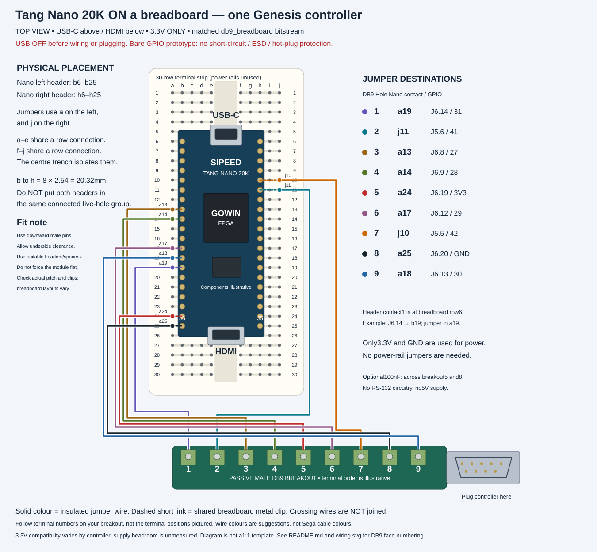
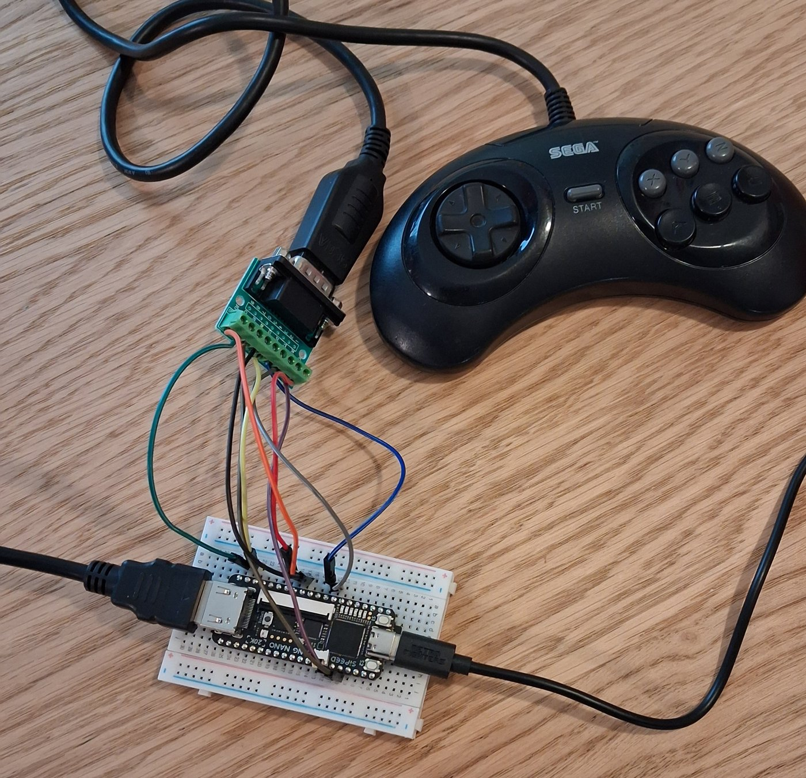

# Single Genesis controller: nine-wire breadboard setup

Wiring for one wired Genesis controller on a Tang Nano 20K, using the
`db9_breadboard` release image (`GT_PAD=db9 GT_PINOUT=breadboard`). No external
resistors or logic ICs are needed for this 3.3 V bench setup: the FPGA's internal
pull-ups bias the six data inputs. It is unprotected, intended for experiments,
and has been bench-tested by the author with one wired six-button Genesis pad;
other pads have not been tried.

Use one ordinary wired Genesis controller that works at 3.3 V. The same nine wires
serve 3-button and 6-button pads; the FPGA polls TH and decodes both. 3.3 V
operation is not guaranteed for every Sega or clone controller.

## Parts

- Tang Nano 20K with soldered pin headers, powered over USB.
- One **male DE-9 passive breakout** with terminals numbered 1-9 (a screw-terminal
  breakout, or a connector with solder cups and insulated wires).
- Nine jumper wires and, optionally, a breadboard.
- Optional but recommended: a 100 nF ceramic capacitor between DB9 pins 5 and 8,
  with short leads.

Do not push a bare DB9 connector into a breadboard: its 2.77 mm staggered pin pitch
does not match the 2.54 mm grid. This is not an RS-232 adapter, USB serial adapter
or level-converter board. The metal shell is not one of the nine pins; it may be
tied to GND, but never use it instead of pin 8.

## The nine connections

View the Nano **component side up, USB-C at the top, HDMI at the bottom**. The left
header is J6 and the right header is J5. Count contacts 1-20 from the USB end. The
"FPGA pin" column is the GPIO number used in the constraints file, not the header
position.

| DB9 pin (male) | Function | FPGA pin | Nano contact |
|---|---|---:|---|
| 1 | D0 / Up | 31 | J6.14 (left, 14th from USB) |
| 2 | D1 / Down | 41 | J5.6 (right, 6th) |
| 3 | D2 / Left | 27 | J6.8 (left, 8th) |
| 4 | D3 / Right | 28 | J6.9 (left, 9th) |
| 5 | Controller supply | **3.3 V, not 5 V** | J6.19 (left, 19th) |
| 6 | TL / B and A | 29 | J6.12 (left, 12th) |
| 7 | TH / select (FPGA output) | 42 | J5.5 (right, 5th) |
| 8 | Ground | GND | J6.20 (left, 20th) |
| 9 | TR / C and Start | 30 | J6.13 (left, 13th) |

[`hardware/wiring.svg`](hardware/wiring.svg) shows the connector from both the
mating face and the solder side; the two views are mirrored, so follow the numbers
moulded into the connector or check continuity, not where the terminals happen to
sit. [`hardware/breadboard.svg`](hardware/breadboard.svg) places the Nano on a
conventional terminal strip with the left header in column b and the right header
in column h (20.32 mm apart, with the centre trench between the two); the exact
holes are listed in [`hardware/breadboard-holes.csv`](hardware/breadboard-holes.csv).
Check your own breadboard's internal connections first, and leave enough clearance
under the module for the pins.

These pins avoid the GPIOs shared with the Nano's HDMI sideband circuitry
(25, 26, 52, 53) and, for player 1, the LED-loaded GPIO 17-20. Keep the Nano's LCD
connector empty. Player 2's pins (17-20, 48, 71, TH on 72) stay assigned in this
build; leave them unwired for a single controller.

## Bench procedure

1. With USB unplugged and the controller disconnected, wire the breakout and check
   all nine connections with a meter. Make sure supply and ground are not swapped or
   shorted. Never connect the controller to the Nano's 5 V pin.
2. Flash `genthang_nano20k_db9_breadboard_flash.bin`, still without the controller,
   and check about 3.3 V between DB9 pins 5 and 8.
3. Unplug USB, connect the controller, then power the board from USB only. Keep the
   jumpers short (about 10 cm or less) and insulated.
4. Test the directions, diagonals and A/B/C/Start, then X/Y/Z/Mode on a 6-button
   pad. The menu is driven by the same pad.
5. If it is unreliable, check the pin mapping, the image variant, the supply at the
   pad and the idle-high levels first. Add the 100 nF capacitor if omitted. Weak
   internal pull-ups may need external 4.7-10 kohm pull-ups to 3.3 V for some
   pads or cables.

## What this setup leaves out

- No series resistors, connector TVS diodes or fuse. A wiring mistake, ESD, a short
  or the wrong accessory can damage the Nano.
- Do not plug or unplug the controller while powered, and do not touch exposed
  contacts.
- The controller is powered from the Nano's 3.3 V regulator. Spare capacity and the
  current drawn by a pad are unmeasured. Use one ordinary wired pad: no rumble
  devices, wireless receivers, externally powered adapters or multitaps.
- **Never apply 5 V to these GPIOs.** If a pad does not work at 3.3 V it needs a
  level-shifted design; raising the supply to 5 V here would damage the FPGA.
